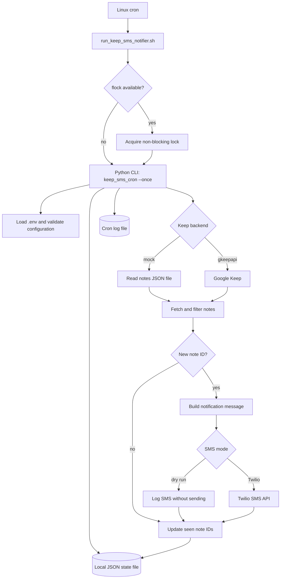

# Google Keep SMS Cron Notifier

A Linux cron automation project that polls Google Keep for new notes and sends an SMS alert when a new note appears.

This project is designed as a portfolio-ready Linux automation example. It demonstrates cron scheduling, environment-based secrets, stateful polling, logging, lock files, Python packaging, tests, and CI.

## What It Does

- Polls Google Keep on a cron schedule.
- Detects notes that have not been seen before.
- Sends an SMS notification through Twilio.
- Stores local state so the same note is not reported repeatedly.
- Supports a mock backend for demos and tests without using real credentials.

## Architecture



Each cron invocation runs one polling cycle. The state file records seen and notified note IDs, so subsequent runs only send alerts for newly discovered notes.

## Important Google Keep Note

Google Keep has an official API, but Google describes it as intended for Workspace enterprise environments. For personal Google Keep accounts, this project supports the unofficial `gkeepapi` Python library. That means the Google Keep integration is useful for a homelab or portfolio automation, but it should be treated carefully and tested against your own account before relying on it for critical workflows.

## Project Layout

```text
.
├── src/keep_sms_cron/       # Application package
├── scripts/                 # Cron-friendly shell scripts
├── tests/                   # Unit tests
├── .github/workflows/       # GitHub Actions CI
├── env.example              # Environment variable template
├── pyproject.toml           # Package metadata
└── requirements.txt         # Runtime dependencies
```

## Quick Demo

The default backend is `mock`, and the default SMS mode is dry-run. That lets you demo the automation locally without Google or Twilio credentials.

```bash
python3 -m venv .venv
source .venv/bin/activate
pip install -r requirements.txt
cp env.example .env
python -m keep_sms_cron --once
```

To simulate a new note:

```bash
mkdir -p demo
cat > demo/notes.json <<'JSON'
[
  {
    "id": "note-1",
    "title": "Linux project idea",
    "text": "Cron job that sends SMS when I add a Google Keep note.",
    "updated": "2026-09-02T12:00:00Z"
  }
]
JSON

KEEP_MOCK_NOTES_FILE=demo/notes.json NOTIFY_EXISTING=true python -m keep_sms_cron --once
```

## Configuration

Copy `env.example` to `.env`, then update values as needed.

| Variable | Purpose |
| --- | --- |
| `KEEP_BACKEND` | `mock` or `gkeepapi` |
| `KEEP_MOCK_NOTES_FILE` | JSON file used by the mock backend |
| `KEEP_GOOGLE_EMAIL` | Google account email for `gkeepapi` |
| `KEEP_MASTER_TOKEN` | Google master token used by `gkeepapi` |
| `KEEP_DEVICE_ID` | Optional stable device ID for `gkeepapi` |
| `KEEP_FILTER_LABEL` | Optional Keep label to monitor |
| `TWILIO_ACCOUNT_SID` | Twilio account SID |
| `TWILIO_AUTH_TOKEN` | Twilio auth token |
| `TWILIO_FROM_NUMBER` | Twilio sender phone number |
| `TWILIO_TO_NUMBER` | Destination phone number |
| `DRY_RUN` | `true` logs SMS messages instead of sending them |
| `NOTIFY_EXISTING` | `true` sends notifications for existing notes on first run |
| `STATE_FILE` | Path to the local JSON state file |
| `LOG_LEVEL` | Python logging level |

## Cron Setup

Install the package, configure `.env`, then run:

```bash
./scripts/install_cron.sh
```

The installer adds a cron entry similar to:

```cron
*/5 * * * * /path/to/project/scripts/run_keep_sms_notifier.sh
```

The runner uses `flock` so overlapping cron runs do not stack up.

## Real SMS Setup

1. Create a Twilio account.
2. Buy or verify a sender number.
3. Set `TWILIO_ACCOUNT_SID`, `TWILIO_AUTH_TOKEN`, `TWILIO_FROM_NUMBER`, and `TWILIO_TO_NUMBER`.
4. Set `DRY_RUN=false`.

## Personal Google Keep Setup

1. Install dependencies with `pip install -r requirements.txt`.
2. Obtain a Google master token for `gkeepapi`.
3. Set `KEEP_BACKEND=gkeepapi`.
4. Set `KEEP_GOOGLE_EMAIL` and `KEEP_MASTER_TOKEN`.
5. Optionally set `KEEP_FILTER_LABEL` to notify only for notes with one label.

## Testing

```bash
python -m unittest discover -s tests
```

## Security Notes

- Do not commit `.env`, tokens, phone numbers, or state files.
- Use a dedicated Google account if you test unofficial Google Keep access.
- Run in `DRY_RUN=true` until the note detection behavior is correct.
- Rotate Twilio and Google credentials immediately if they are accidentally exposed.

